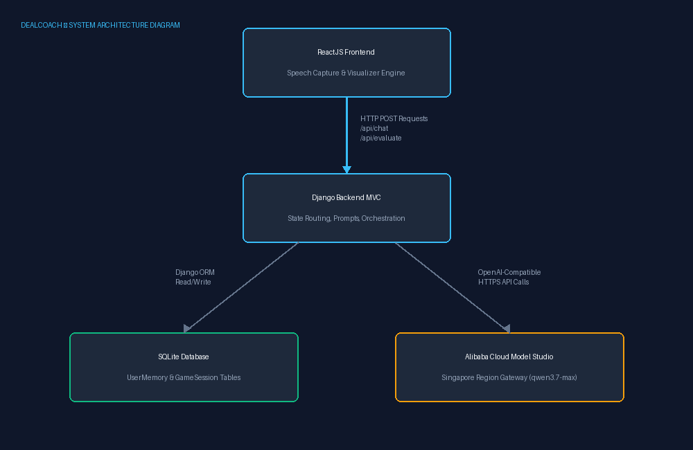

# DealCoach — Cross-Session Adaptive Adversarial Simulator

DealCoach is an intelligent, voice-and-text conversational training platform designed for high-stakes professional negotiations. Built specifically for **Track 1: MemoryAgent** of the Global AI Hackathon with Qwen Cloud, the application leverages an agentic state-machine architecture to simulate ruthless real-world adversaries (VC Investors, Investigative Journalists, Politicians, and Board CEOs). 

Instead of expanding context windows by continuously dumping raw historical chat transcripts back into system prompts, DealCoach isolates strategic user flaws across multi-turn, cross-session boundaries using localized memory consolidation.

## 🚀 Hackathon Quick-Reference
* **Target Track:** Track 1: MemoryAgent
* **AI Infrastructure:** Natively hosted on Alibaba Cloud Model Studio (Singapore Region Gateway)
* **Core Model:** Flagship reasoning engine `qwen3.7-max` (via OpenAI-compatible API layer)
* **Open Source License:** MIT License (Visible in Repository Metadata)

---

## 🧠 Architectural Overview & Memory Engine

DealCoach operates a dual-plane memory management system to maintain minimal token overhead while weaponizing long-term user context:

1. **The Short-Term Dialogue Plane:** Manages active turn-by-turn chat states using localized frontend arrays passed through Django view endpoints. Raw transcripts are flushed on session termination.
2. **The Long-Term Cognitive Plane:** Upon clicking the evaluation phase, an offline synthesis loop passes the complete transcript to `qwen3.7-max`. The model extracts a raw critical mistake string, combines it seamlessly with historical database entries (`UserMemory`), updates the state, and immediately discards ambient chat logs to enforce efficient data retention and prevent context pollution.

On the immediate next interaction (even across entirely separate adversarial personas), the system initializes by injecting this distilled vulnerability profile straight into the opening exchange, forcing an instant, high-pressure confrontation.

---

## 🛠️ Project Installation & Local Setup

### 1. System Requirements
* Python 3.10+
* Node.js 18+ / npm 9+
* Active Alibaba Cloud Model Studio Account (with Singapore Region Enabled)

### 2. Backend Installation (Django)
Navigate to your backend server folder:
```bash
cd "C:\Users\VIDA\Desktop\hackerton coach\dealcoach"
```

Create a `requirements.txt` file in this directory with the following contents:
```text
Django==4.2.13
djangorestframework==3.15.2
django-cors-headers==4.3.1
openai==1.30.5
python-dotenv==1.0.0
requests==2.31.0
```

Install the dependencies:
```bash
pip install -r requirements.txt
```

Create a `.env` file inside your `dealcoach` backend root directory:
```env
DASHSCOPE_API_KEY="your_secret_alibaba_dashscope_api_key"
QWEN_WORKSPACE_ID="your_singapore_workspace_id"
```

Run database migrations to initialize the `UserMemory` and `GameSession` structures:
```bash
python manage.py migrate
```

Start the development backend server:
```bash
python manage.py runserver
```

---

### 3. Frontend Installation (React + Vite)
Navigate to your client user interface directory:
```bash
cd "C:\Users\VIDA\Desktop\hackerton coach\dealcoach\frontend"
```

Ensure your `package.json` contains the following dependencies:
```json
{
  "dependencies": {
    "react": "^18.3.1",
    "react-dom": "^18.3.1",
    "axios": "^1.7.2",
    "framer-motion": "^11.2.10",
    "tailwindcss": "^4.0.0-alpha.20"
  },
  "devDependencies": {
    "@types/react": "^18.3.3",
    "@types/react-dom": "^18.3.0",
    "@vitejs/plugin-react": "^4.3.0",
    "vite": "^5.2.0"
  }
}
```

Install the node modules:
```bash
npm install
```

Start the local client application:
```bash
npm run dev
```

---

## 📡 API Architecture & Routing Layout

The Django backend exposes three critical endpoint handlers mapped under the `/api/` routing namespace:

* **`POST /api/chat`**: Streams messaging arrays to the `qwen3.7-max` model. Dynamically updates system prompts based on current database-persisted vulnerability records.
* **`POST /api/evaluate`**: Terminates the active negotiation track, parses the conversation structure, saves performance analytics, and runs the memory consolidation routine.
* **`POST /api/reset-memory`**: Completely purges all long-term psychological profiling and session history tracking from the database, returning the agent to its absolute baseline state.

---

## 📊 System Architecture Diagram



---

## 📄 Open Source License
This project is open-source and distributed under the terms of the **MIT License**. Check the root repository `LICENSE` file for full parameters.
